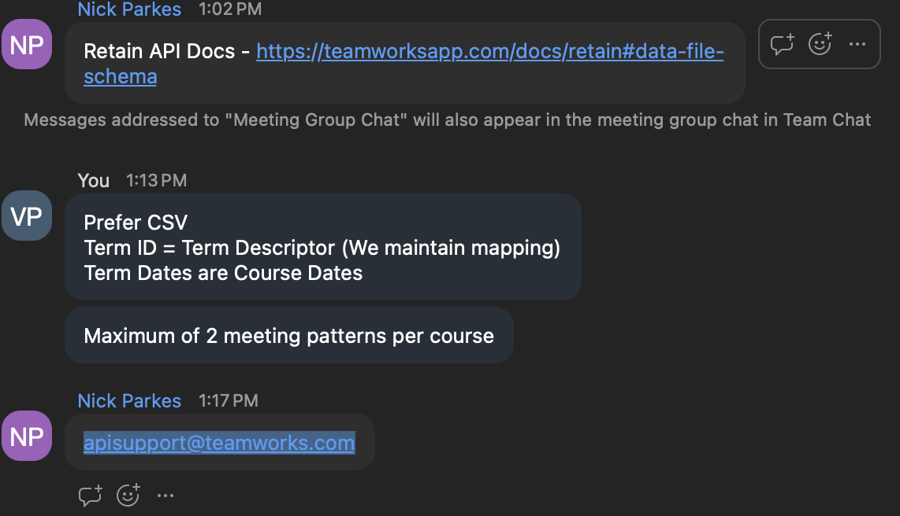

## About
Imports student schedules for athletic roster (current year term) from J1 to ARMS.

### Questions
- Can you pull rosters from ARMS?
	- **No, but it would have been ideal to because `SPORTS_TRACKING` in theory could have rows other than the ones imported from ARMS in the other ARMS integration.**
- Can both ARMS jobs be consolidated into this one?
	- **Yes, but we should keep them separate anyway.**
- What kind of term codes should the job process?
	- Just "FA"/"SP"? (traditional year term codes)
	- Or "SU" as well?(supplementary terms)
	- **Custom logic in the notes section**
- Teamworks engineer said:
	- We need to maintain a mapping of term id/descriptor, what did he mean?
	- There are a maximum of 2 meeting patterns per course, is this going to cause an issue?
- API Behavior
	- Can we import schedules for multiple semesters?
	- What if multiple semesters have courses with 3 different meeting patterms?
	- Can we get rid of schedules? What if someone's schedule changes?

### Notes
- Current year term logic (from Chelsea)
	- Fall window (from end of spring to end of fall)
		- EG: May 5th (example spring end date) to December 3rd (example fall end date)
	- Spring window (from end of fall to end of spring)
		- EG: December 3rd (example fall end date) to May 5th (example spring end date)
	- J-term window (from end of fall to end of J term)
		- EG: December 3rd (example fall end date) to Jan 14th (example J term end date)
- Teamworks meeting notes (their API has some nuances)



### Tips
- API allows dry runs for testing

### Resources
- [API Documentation](https://teamworksapp.com/docs/retain)
- API Credentials in 1Password ("Teamworks Credentials")

### Implementation

```php
public function handle()
{
	$currentYearTerm = DB::connection("j1")->query()->...
	$schedules = $j1DataService->getStudentSchedulesForYearTerm($ids, "2425", "FA")
	$csv = // convert schedule to CSV (may require more data than just schedules)
	try {
		$importId = $teamworksApiService->importEnrollments() // internally calls async endpoint and polls until fail or complete
	} catch (\Throwable $exception) {
		$this->error($exception->getMessage())
		return Command::Failure;
	}
	$this->info("Some success message")
	return Command::Success
}
```

### Queries/Sub Logic

#### $currentYearterm
```sql
SELECT * FROM YEAR_TERM_TABLE WHERE TRM_END_DTE > GETDATE() AND TRM_CDE IN ('FA', 'SP') AND TRM_BEGIN_DTE IS NOT NULL ORDER BY TRM_BEGIN_DTE
```

```php
$currentAndFollowingYearTerms = //use query above
if ($currentAndFollowingYearTerms[0]) 
```
#### getAthleticRosterForYearTerm()
```sql
SELECT * FROM SPORTS_TRACKING WHERE YR_CDE = '2324' AND TRM_CDE = 'SP'
```

#### getStudentSchedulesForYearTerm()
```sql
TODO
```

### Tests
- Appropriately converts J1 schedule query response to CSV
- Appropriately calls student schedule query based on roster query response